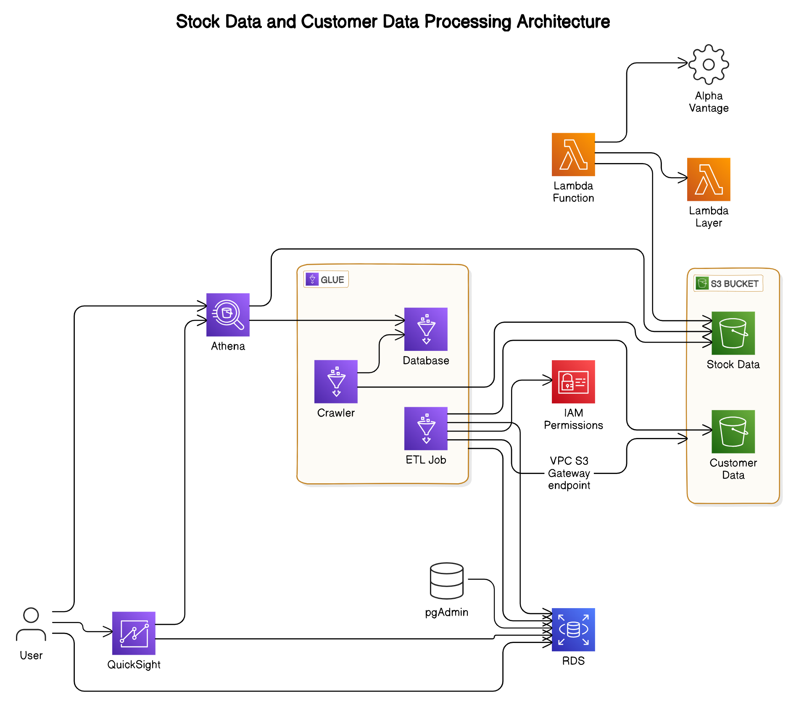

# Automated Data Ingestion, Processing, and Analysis Using AWS Services

## Overview

This project demonstrates an automated data pipeline for ingesting, processing, and analyzing stock market data and customer data using AWS services. The key AWS services used include AWS Lambda, Glue, RDS, Athena, and QuickSight. The architecture ensures efficient handling and analysis of large datasets in the cloud.

## Architecture Diagram

## Purpose

The main goal of this project is to create an automated pipeline for fetching stock data and customer data, processing it, and storing it for further analysis. This helps in transforming unstructured and semi-structured data into a structured format that can be queried and visualized easily.

## Key Components

### 1. Lambda Function for Stock Data Ingestion

**Lambda Function Name**: `stock_data_lambda`

- Fetches stock data for INFY.BSE from Alpha Vantage.
- Stores the data in an S3 bucket in CSV format.
- Uses a Lambda layer to include necessary dependencies.

### 2. Glue Crawlers for Data Cataloging

- **Stock Data Crawler**: Catalogs stock data stored in S3.
- **Customer Data Crawler**: Catalogs customer data stored in S3.

### 3. Glue Job for ETL

**Glue Job Name**: `CustomerDataETLJob`

- Transforms customer data.
- Creates tables in RDS and uploads data from Glue tables to RDS.

### 4. RDS for Data Storage

- Stores the processed customer data for efficient querying.
- Tables include `Customers`, `Portfolios`, and `Transactions`.

### 5. Athena and QuickSight for Data Analysis

- **Athena**: Used for querying stock data stored in S3.
- **QuickSight**: Used for creating interactive dashboards to visualize data trends.

## Why We Did It

- **Automation**: Automates the process of fetching, processing, and storing data.
- **Efficiency**: Uses cloud-native services to handle large datasets efficiently.
- **Scalability**: Ensures the solution can scale with increasing data volume.
- **Ease of Analysis**: Facilitates easy querying and visualization of data.

## Problems Solved

- **Manual Data Handling**: Eliminates the need for manual data fetching and processing.
- **Data Structuring**: Converts unstructured and semi-structured data into a structured format.
- **Real-time Analysis**: Enables real-time data analysis using Athena and QuickSight.

## Repository Contents

- **Customer data/CutomerInfo=22072024**: Contains customer data in CSV files.
  - `Secret Candles customer data- test - Customers.csv`
  - `Secret Candles customer data- test - Portfolios.csv`
  - `Secret Candles customer data- test - transactions.csv`
- **GlueJobScripts**: Contains the Glue job script.
  - `Python_GlueJob.py`
- **Lambda_codes/INFY.BSE-Daily**: Contains the Lambda function code.
  - `lambda_function_code.py`
- **Lambda_layer**: Contains the Lambda layer zip file.
  - `python.zip`
- **diagram.png**: Architecture diagram of the project.

## Getting Started

1. **Set up AWS services**: Configure Lambda, Glue, RDS, Athena, and QuickSight.
2. **Deploy Lambda function**: Upload the function code and set environment variables.
3. **Create Glue crawlers and job**: Set up crawlers to catalog data and a job to transform and load data into RDS.
4. **Query and visualize data**: Use Athena for querying and QuickSight for visualization.

# For more detailed explanation of the project please visit below Google Docs link:
  Docs link: [https://docs.google.com/document/d/1VryReFDwqE1WvKCpXsXLDZeAy5RADyHeOMItxQjC6NI/edit?usp=sharing]

## Conclusion

This project showcases an end-to-end data pipeline solution using AWS services, automating the process of data ingestion, transformation, storage, and analysis. It highlights the power and flexibility of AWS in handling big data workflows efficiently and effectively.
